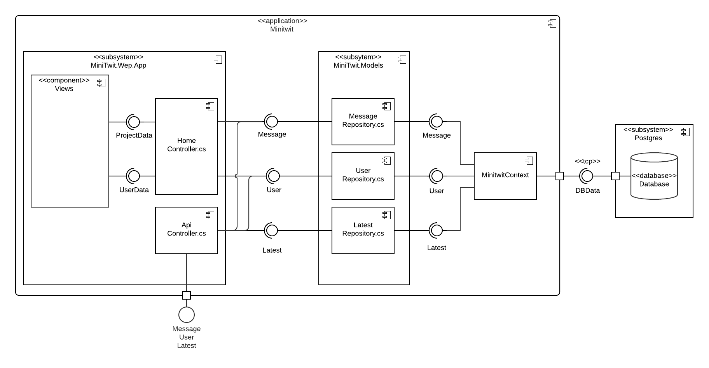

### System Design 
The MiniTwit application is web app written in C# using ASP.NET. Data is stored using EntityFrameworkCore as a database abstraction layer working with a Postgres database. Transfer of data between the frontend and backend follows the [Repository design pattern](https://martinfowler.com/eaaCatalog/repository.html).

The application has three main C# Projects, MiniTwit.Web.App, containing the web app, MiniTwit.Models containing the repositories for the different types of data handled by the application and MiniTwit.Entities, containing the entities of the application, and the DBContext from EntityFramework called MiniTwitContext. The application also has other projects containing utility functions, and projects for testing.

*Figure x: A component diagram describing the main components of the MiniTwit system.*

As illustrated in figure x, the `MinitwitContext` allows the repositories to access their relevant data. The repositories then contain the relevant methods for passing the data on in specific formats to the frontend controllers, contained in `MiniTwit.Web.App`. The `HomeController` passes this data on to the views in the Views directory, where they are used when accessed in a browser, while the `APIcontroller` instead exposes the API that the simulator uses.

The application is written completely in C#, because the team wanted to learn the different aspects of C#. After all, it made it easier to connect all the parts of the application, and the team had experience with it allowing work to be done faster. Thus, the frontend of the application is written as an ASP.NET Core application using cshtml, the security layer is made using ASP.NET Identity, and EntityFrameworkCore is used for the database abstraction layer.

The choice of the repository pattern, was made because the team had worked with the pattern in C# before, and thus would be able to implement it quickly, and have a reference point of how it should be set up.