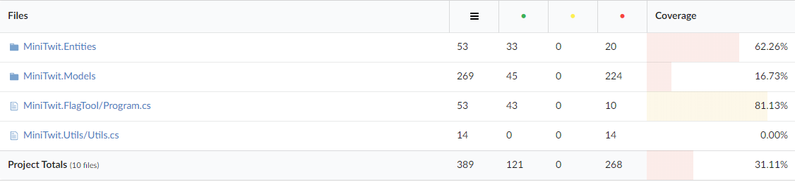
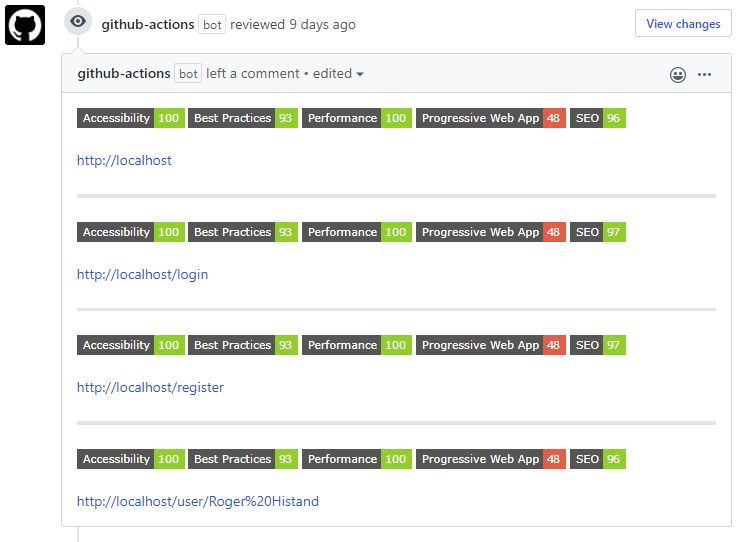

### Current state of the system

While the specific tools used for static analysis will be described in later sections, there are three main measures for quality assessment in the system:

- A static analysis report from Sonarcloud.io
- A test coverage report from CodeCov
- A performance and accessibility report from Lighthouse 

According to the [Sonarcloud report](https://sonarcloud.io/dashboard?id=jlndk_devoops), the project has 0 bugs, 0 vulnerabilities, 0 debt, and 1% duplication. It also reports that there is 0% coverage, but this is because coverage is handled by Codecov.

The [CodeCov report](https://codecov.io/gh/jlndk/devoops) states that the project overall has 31.11% line coverage. Details about which parts of the application are analyzed by CodeCov, and a breakdown of their coverage can be seen in figure X.

*Figure X: Codecov report breakdown*

Finally, according to the last report made by Lighthouse, which can be seen in figure Y, the application scores 100 on accessibility, 93 on best practices, 100 on performance, 48 on progressive web app, and 97 on SEO. It is worth mentioning that the 93 on best practices stems from the fact that tests are done via HTTP, while the version of the application in production uses HTTPS. 

*Figure Y: Lighthouse report*

As such, the application generally scores high on the chosen metrics, with the exception of Code Coverage which could be much better. This is likely because developers have not been forced to make tests when developing code, which usually means they aren't written. The other metrics however, are likely because these tools have been used which means that developers can see what aspects of the application could be improved. Thus, the use of these tools as a DevOps practice has led to a better project overall. 
