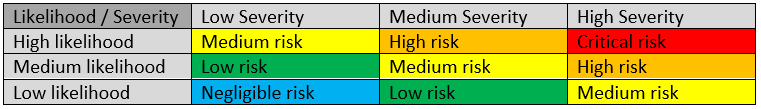

## Security
### Risk Assessment

 
*Figure 8: Risk assessment matrix.*

#### Leaking user data

* **Description**: Most user data is public, but a few critical things such as emails and passwords are not. Leaking passwords is unlikely as they are stored only as hashes, but it is still technically possible, for example, due to logging misconfiguration. The database is the most likely attack vector for accessing sensitive data.
* **Severity**: High
* **Likelihood**: Low
* **Risk**: Medium

#### Losing user data

* **Description**: Losing user data could be due to a database failing, a developer accidentally deleting the data or faulty programming. No procedures are in place to prevent this.
* **Severity**: High
* **Likelihood**: Medium
* **Risk**: High

#### Leaking performance data
  
* **Description**: Leaking system performance data such as uptime, CPU load, etc. is unwanted but not dangerous. This could be mitigated by setting up a firewall or authentication to prevent outside clients from accessing the metrics endpoint of our applications.
* **Severity**: Low
* **Likelihood**: High (we know this is happening)
* **Risk**: Medium

#### Losing system availability
  
* **Description**: Whether due to faulty programming, high load, or outside network attacks, breaking the SLA is unwanted. Monitoring is set up to alert admins during downtime. No automatic scaling or DDOS protection is in place, due to cost.
* **Severity**: Medium
* **Likelihood**: Medium
* **Risk**: Medium

## Vulnerability Testing

### SonarCube security reports
As part of our CI pipeline, SonarCube will analyze pushed code for potential security problems, such as hard-coded credentials, out of date dependencies and insecure handling of user data. The analysis results are by no means exhaustive but serve as the first line of defense and run almost for free, both in terms of financial cost and time cost.

### Penetration Testing
Through a combination of security testing done by an internal team and an external team, the following have been discovered about the system:

* The authentication key for the simulator is hardcoded into the codebase. It should instead be securely stored in a secrets key store or an environment variable, even if it is currently required to be a specific known value based on the spec.
* No vulnerabilities were found on the website, likely due to how much the chosen web framework ASP.NET handles out of the box.
  * No SQL injection, due to the use of the Entity Framework ORM.
  * No Cross-site Request Forgery, thanks to ASP.NET’s automatic form security.
  * No cookie stealing thanks to how ASP.NET Identity works.
  * No local data (such as cookies) in Iframes and no access to form pages such as login through Iframes. This prevents clickjacking.
  * No Cross-site Scripting due to how Razor handles dynamic data in HTML.
* Thanks to the reverse proxy Træfik, the site uses HTTPS, which means that MITM attacks are virtually impossible in modern browsers.
* Virtual Servers are secured with SSH keys and password-logins has been disabled by default.

The list above is partially based on OWASP’s [Top 10 Web Security Vulnerabilities](https://owasp.org/www-project-top-ten/).
